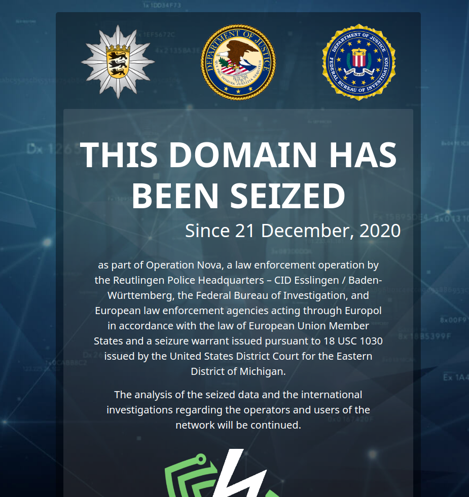

# Operation In Our Sites

###### From Wikipedia, the free encyclopedia

Operation In Our Sites is an ongoing effort by the National Intellectual Property Rights Coordination Center in the U.S.
government, to detect and hinder intellectual property violations on the Internet. Pursuant to this operation,
governmental agencies arrest suspects affiliated with the targeted websites and seize their assets including websites'
domain names. Web users intending to access targeted websites are directed to the server operated by the U.S.
government, and greeted with a graphic bearing the seals of the United States Department of Justice (DOJ), the National
Intellectual Property Rights Coordination Center (NIPRCC), and U.S. Immigration and Customs Enforcement (ICE).

## Preview




## Minify and Bundle Html

A script using Bun has been implemented, which directly injects the CSS into the first existing `<style>` tag 
within the document's `<head>`. Additionally, the MasterCSS script library has been removed when the script is executed,
as the styles are now generated directly, making the dependency unnecessary with minify html.
Furthermore, the script automatically minifies the code deleting comments and line breaks.

Command to run the script:

```shell
bun run index.ts
```

